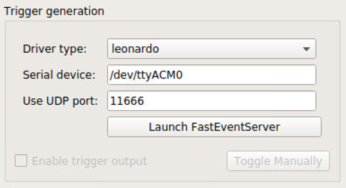

= Pose-Trigger
:doctype: book
:toclevels: 3
:toc:
:icons: font

ifdef::env-github[]
:tip-caption: :bulb:
:note-caption: :information_source:
:important-caption: :heavy_exclamation_mark:
:caution-caption: :fire:
:warning-caption: :warning:
endif::[]

Pose-Trigger is a python application for real-time, closed-loop application
of TTL trigger generation based on the pose of the subject.

image::resources/Screenshot.png[A screenshot of a working Pose-Trigger app (in a development version)]

== Introduction

=== What can Pose-Trigger do?

Pose-Trigger is designed to work on a linux computer equipped with a high-speed video camera.
The current version of the software features:

. Acquisition of *high-speed videos* (up to 100-200 fps without on-line pose estimation).
.. On-line exposure/gain adjustment.
.. Adjustment of acquisition intervals.
. *On-line estimation of body-part positions* using http://www.mousemotorlab.org/deeplabcut[DeepLabCut].
.. On-line evaluation of *arbitrary posture conditions* based on the estimated body-part positions.
.. *Fast output-trigger generation* (<1 ms) using the https://doi.org/10.5281/zenodo.3843623[FastEventServer] program.
. *Brightness/contrast adjustment* for on-line display.
. *Storage of frames* into the NumPy-style zip archive.

== Installation

=== Requirements

==== Minimum requirements

At the very basics (i.e. acquisition), you need the followings:

. *A linux computer* (tested on https://releases.ubuntu.com/18.04.5/[Ubuntu 18.04 LTS])
. An installation of **Python, version >=3.4**. We recommend installing the following libraries using e.g. https://www.anaconda.com/[Anaconda]:
.. NumPy
.. Matplotlib
.. python-opencv
.. PyQt (required for pyqtgraph)
.. http://pyqtgraph.org/[pyqtgraph] (through `pip`, instead of through `conda`)
. a 16-bit monochrome video camera from https://www.theimagingsource.com/[ImagingSource]. Other Video4Linux2-compliant cameras should also work with a few adjustments in the code, but will require some efforts.

==== Requirements for on-line position estimation

In addition, the on-line position-estimation feature requires the followings in your environment:

. An installation of http://www.mousemotorlab.org/deeplabcut[*DeepLabCut*] (any versions after 1.11 should work).
. For a faster working of DeepLabCut, *NVIDIA graphics board with a large amount of RAM* would be needed. For example, running DeepLabCut on ResNet-50 requires ~10.6 GB of RAM, so we use https://www.nvidia.com/en-eu/geforce/graphics-cards/rtx-2080-ti/[GeForce RTX 2080 Ti] that has 11 GB on-board RAM.

==== Requirements for fast-trigger generation

Finally, the fast-trigger feature requires the followings:

. The https://doi.org/10.5281/zenodo.3843623[*FastEventServer*] *server program*. If you use a 64-bit linux computer (it is most likely these days), you can use the `FastEventServer_linux_64bit` pre-built program bundled with the repository, and do not have to build it yourself.
. An https://store.arduino.cc/arduino-uno-rev3[*Arduino UNO*] or its clone, flashed using the https://doi.org/10.5281/zenodo.3515998[arduino-fasteventtrigger] program.

[IMPORTANT]
=========
*IMPORTANT NOTE*: `arduino-fasteventtrigger`, in reality, will *only make use of the serial-to-USB conversion tip on the UNO (i.e. https://www.microchip.com/wwwproducts/en/ATmega16U2[ATmega16U2])*. This means:

- Make sure that your UNO clone has the ATmega16U2 as its converter chip.
- Other USB-based boards that uses the ATmega16U2 chip _may_ work (although not recommended or supported).

=========

==== Reference setup specifications

We develop and test Pose-Trigger in the following environment:

===== Hardware

.Table Reference setup hardware specifications
[%header]
|===
| Part name | Model type
| CPU       | 3.7 GHz Core i7-9700K
| RAM       | 64 GB DDR4-3200
| GPU       | NVIDIA GeForce RTX 2080 Ti (11 GB RAM)
| Camera    | ImagingSource DMK 37BUX287
| Output board | Arduino UNO, rev. 2 (clone), with `arduino-fasteventtrigger`
|===

===== Software

.Table Reference setup software environment
[%header]
|===
| Software           | Specification
| Operating system   | Ubuntu 18.04 LTS
| Python environment | Anaconda3, Python 3.7.7
| CUDA Toolkit       | version 10.1 (through `conda`)
| Tensorflow         | version 1.13.1 (`tensorflow-gpu` package of `conda`)
| DeepLabCut         | version 2.1.3
| NumPy              | version 1.19.1 (through `conda`)
|===

=== Install procedures

Install all the python packages in your DeepLabCut environment, in case it applies.

. (Optional) set up a DeepLabCut environment.
. Install the libraries specified in "minimum requirements".
. Install `timedcapture`: this is the library for video acquisition. Follow the installation procedure in the repository.
. Install the `pose-trigger` module:
.. Clone this repository.
.. Open this repository in `Terminal`.
.. Run `pip install .` on `Terminal`.

[TIP]
Upon the public release of Pose-Trigger in the future, both `timedcapture` and `pose-trigger` packages will be made available in PyPI. One will be able to install these packages through `pip`.

== Quick guide

=== Launching Pose-Trigger

. Open `Terminal`.
. Run `pose-trigger` on `Terminal`.

[TIP]
When being run without a parameter, Pose-Trigger will use the device on `/dev/video0` by default. In case you want to use e.g. `/dev/video1`, specify the device as the parameter, i.e. run `pose-trigger /dev/video1`.

=== Organization of the main window

image::resources/Layout_Overview.png[Overview of the main window]

The Pose-Trigger main window can be divided into three groups:

. The *Capture* buttons (yellow) is for starting/stopping acquisition.
. The *Preview* panel (green) is an on-line preview of the acquired video frames. If body position-estimation is activated, estimated positions will be shown as colored circles, too.
. In the *Settings* panel (blue), you can configure how acquisition is performed.

=== Capturing videos

==== Capture modes

There are two modes of running for Pose-Trigger:

. *FOCUS mode*: capturing video frames without storing them
. *ACQUIRE mode*: captures video frames _and_ stores acquired data

You can start/stop either of the capturing modes by clicking on the button at the bottom of the main window.

[IMPORTANT]
*Pose-Trigger does _not_ stream data into storage during acquisition!* During acquisition, it keeps all the data in-memory. The data will be written out to a file only _after_ acquisition. The duration of acquisition will be thus limited to the order of 1–2 minutes.

[IMPORTANT]
====

Currently, the following parameters are "hard-coded" and used as default:

- Image format: 640x480 pixels, 16-bit grayscale
- Timing generation: a busy-wait algorithm
- Storage format: the NumPy zip-file format (.npz)

====

==== Format of the saved files

The data are saved in the NumPy zip-file format (i.e. ".npz" file). Each file includes the following entries:

.Table Entries in saved files
[%header]
|===
| Name         | Always there?  | Description
| `frames`     | Yes            | frame data, with the 3-D shape being (frame-index, height, width)
| `timestamps` | Yes            | 1-D array containing unix timestamps in seconds
| `metadata`   | Yes            | a JSON-serialized text object containing information on acquisition configuration
| `estimation` | No (Optional)  | when a DeepLabCut project is selected; 3-D array with the (frame-index, parameter) shape
| `trigger_status` | No (Optional) | when pose-evaluation is enabled; 1-D boolean array of evaluation results
|===

(TODO: examples)

=== Panel-by-panel guide

==== "Camera" panel

Here, you can set the exposure and the gain of each video frame acquisition.

[NOTE]
For the time being, the image format is restricted to 16-bit grayscale, with the 640x480 frame size (otherwise there will be an unexpected behavior).

==== "Preprocessing" panel

image::resources/Panels_preprocessing.png[Preprocessing settings]

This controls the brightness/contrast settings for "live" video frames. It controls signal conditioning parameters for:

- Video-frame preview
- Body-part estimation (the images being fed to DeepLabCut)

On the other hand, *the raw, unconditioned images are used* for data storage.

==== "Acquisition" panel

Here you can set the (targeted) acquisition intervals. For example, if you want to have Pose-Trigger running at 50 Hz, set this interval to 20 ms.

[NOTE]
For the time being, you can only choose to use the busy-wait timing-generation mechanism.

==== "DeepLabCut evaluation" panel

image::resources/Panels_evaluation.png[Evaluation mode control]

Here, you can configure how DeepLabCut should work in real-time.

===== Project selection

By using the "Select" button, you can select your DeepLabCut project of choice. Conversely, by clicking on the "Clear" button, you can un-set the project.

When a project is selected, the panel shows the body-part labels being registered in the project.

As long as a project is selected here, body-part position estimation occurs during video-capture processes. Estimated positions will also be stored in the data file in the case of the `ACQUIRE` mode.

===== Pose evaluation

You can enable pose evaluation by ticking the "Enable evaluation" button. Evaluation occurs using *the boolean expression entered in the "Expression" field*. The "expression" can be any Python one-line expression, but it has to be evaluated to be a boolean.

When specifying the boolean expression, you can use a *placeholder-based reference* to body part positions. For example, by entering `{Tip1.x}`, you can use the X coordinate of `Tip1` as a parameter. Other than the `x` property, you can also use the `y` and `p` properties of a body part to refer to the Y coordinate and the probability

In computation of the expression, some major libraries can be used: use `math` for representing the `math` standard library, and use `np` to refer to the `numpy` library. For example, the expression below calculates the Euclidean distance between two body parts, `Tip1` and `Tip2`:

[source]
--
math.sqrt( ({Tip1.x} - {Tip2.x})**2 + ({Tip1.y} - {Tip2.y})**2 )
--

In addition, to enable testing of the output latency at the trigger-generation step, the custom placeholder, `{EVERY10}` is there. By using the following expression, you can toggle trigger output on and off every 10 frames:

[source]
--
{EVERY10}.get()
--

==== "Trigger generation" panel

Here, you can test and control trigger generation.

===== Transferring evaluation results to FastEventServer

By ticking "Enable trigger output", it starts sending the result of evaluation (true/false value) to FastEventServer.

===== Manually toggling the trigger

When trigger-output based on evaluation results is disabled, you can manually toggle the trigger output on and off, using the "Toggle manually" button.

[IMPORTANT]
For the time being, the "trigger UDP port" cannot be specified; if Pose-Trigger fails to connect to FastEventServer on port 11666 at the beginning of its launching, it just disables the trigger-output functionality.

==== "Storage" panel

Here, you can control how acquired data are stored.

*File names are automatically generated* using the text entered in the "File-name format" field. You can use the following *format directives*. These fields are passed on straight to the `datetime.strftime` method (refer to https://docs.python.org/3/library/datetime.html#strftime-and-strptime-behavior[the python datetime module documentation] on the specific format directives).

[IMPORTANT]
Be cautious of Pose-Trigger *automatically overwriting existing files*! Try to include (at least) the minutes/seconds directive into the file-name format, so that you do not unexpectedly delete your previous videos.

== How Pose-Trigger works: concepts

(TODO)
