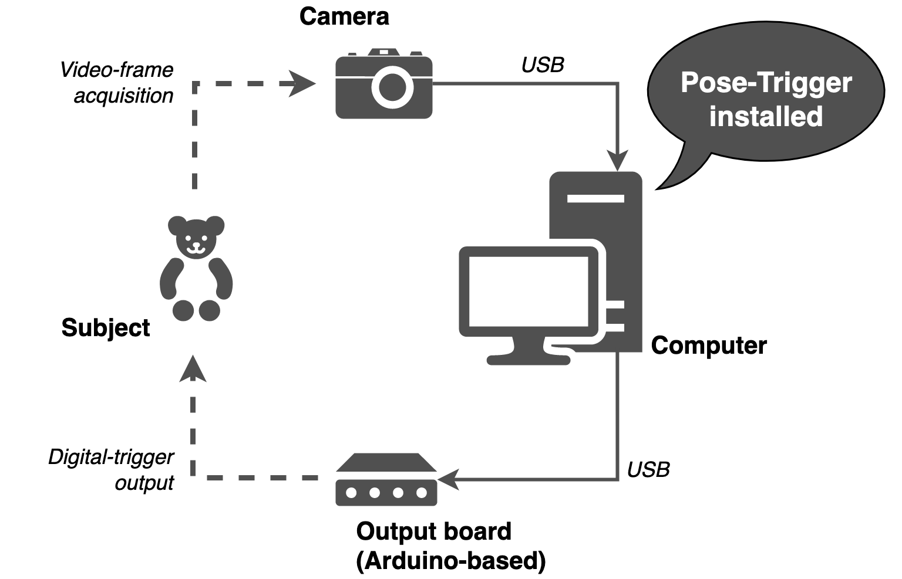
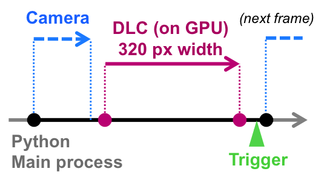

Introduction
============

.. contents:: Contents
   :local:
   :depth: 3

What Pose-Trigger can do
-------------------------

Pose-Trigger is designed to work on a linux computer equipped with a high-speed video camera.

The current version of the software features:

*  Acquisition of **high-speed videos** (up to 100-200 fps without on-line pose estimation).

  * On-line exposure/gain adjustment.
  * Adjustment of acquisition intervals.

* **On-line estimation of body-part positions** using `DeepLabCut`_.

  * On-line evaluation of **arbitrary posture conditions** based on the estimated body-part positions.
  * **Fast output-trigger generation** (<1 ms) using the `FastEventServer`_ program.

* **Brightness/contrast adjustment** for on-line display.
* **Storage of frames** into the NumPy-style zip archive.

How Pose-Trigger works
-----------------------

Pose-Trigger is essentially a Python application.
You can install Pose-Trigger on a Linux computer, and run from Terminal by typing:

.. code-block:: Bash

    $ pose-trigger

(The ``$`` character represents a prompt. You are not supposed to type it)

The model setup
^^^^^^^^^^^^^^^^

    The model setup

Above is the model setup that uses Pose-Trigger.
Pose-Trigger is designed to work in a closed-loop experiment setup,
where a single PC acquires video frames from the camera and
generates trigger output based on the behavior of the subject.

For more detailed system requirements, refer to the :ref:`System requirements <requirements>` section.

The main acquisition loop
^^^^^^^^^^^^^^^^^^^^^^^^^^

Below is the schematics for the main acquisition loop:

    The main acquisition loop

1. The **timer** generates timings for the acquisition of the next frame (black filled circles).
2. Pose-Trigger commands the camera to acquire a video frame, and receive it (blue dashed arrow).
3. Pose-Trigger delegates body-part estimation to the underlying `DeepLabCut`_ library (in case it exists; magenta arrow).
4. Pose-Trigger updates the status of trigger output by sending information to `FastEventServer`_ (in case it is serving; green arrowhead).

.. _DeepLabCut: http://www.mousemotorlab.org/deeplabcut
.. _FastEventServer: https://doi.org/10.5281/zenodo.3843623
