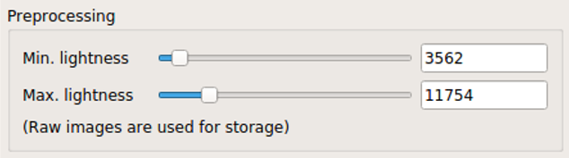
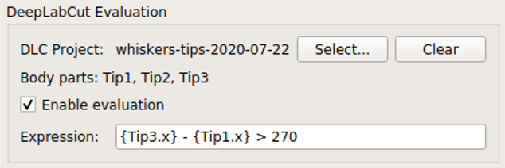
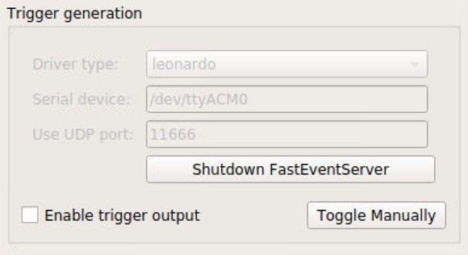

.. _panels:

Panel-by-panel guide
=====================

.. contents:: Contents
   :local:
   :depth: 3

"Camera" panel
---------------

.. figure:: ../../resources/Panels_camera.png
    :scale: 60%

    "Camera" panel for capture-parameter settings

Here, you can set the exposure and the gain of each video frame acquisition.

.. note::
    For the time being, **the image format is restricted to 16-bit grayscale, with the 640x480 frame size** (otherwise there will be an unexpected behavior).

"Preprocessing" panel
----------------------

    "Preprocessing" settings

This controls the brightness/contrast settings for "live" video frames. It controls signal conditioning parameters for:

* Video-frame preview
* The images being fed to DeepLabCut (i.e. body-part position estimation)

On the other hand, **the raw, unconditioned images are used** for data storage.

"Acquisition" panel
--------------------

.. figure:: ../../resources/Panels_acquisition.png
    :scale: 60%

    "Acquisition" timing control

Here you can set the (targeted) acquisition intervals. For example, if you want to have Pose-Trigger running at 50 Hz, set this interval to 20 ms.

.. note::
    For the time being, you can only choose to use the busy-wait timing-generation mechanism. This means that the *minimum* inter-frame interval is set to the value specified here.

.. _pose-evaluation:

"DeepLabCut evaluation" panel
------------------------------

    "Evaluation" mode control

Here, you can configure how DeepLabCut should work in real-time.

Project selection
^^^^^^^^^^^^^^^^^^

By using the "Select" button, you can select your DeepLabCut project of choice. Conversely, by clicking on the "Clear" button, you can un-set the project.

When a project is selected, the panel shows the body-part labels being registered in the project.

In addition, as long as a project is selected here, body-part position estimation occurs during video-capture processes.
Estimated positions will also be stored in the data file in the case of the :ref:`ACQUIRE mode<capture-modes>`.

Pose evaluation
^^^^^^^^^^^^^^^^

You can enable pose evaluation by ticking the "Enable evaluation" button. Evaluation occurs using **the boolean expression entered in the "Expression" field**. The "expression" can be any Python one-line expression, but it has to be evaluated to be a boolean.

When specifying the boolean expression, you can use a **placeholder-based reference** to body part positions. For example, by entering ``{Tip1.x}``, you can use the X coordinate of ``Tip1`` as a parameter. Other than the ``x`` property, you can also use the ``y`` and ``p`` properties of a body part to refer to the Y coordinate and the probability.

In computation of the expression, some major libraries can be used: use ``math`` for representing the ``math`` standard library, and use ``np`` to refer to the ``numpy`` library. For example, the expression below calculates the Euclidean distance between two body parts, ``Tip1`` and ``Tip2``:

.. code-block:: python

    math.sqrt( ({Tip1.x} - {Tip2.x})**2 + ({Tip1.y} - {Tip2.y})**2 )

In addition, to enable testing of the output latency at the trigger-generation step, the custom placeholder, ``{EVERY10}`` is there. By using the following expression, you can toggle trigger output on and off every 10 frames:

.. code-block:: python

    {EVERY10}.get()

"Trigger generation" panel
---------------------------

.. figure:: ../../resources/Panels_triggering.png
    :scale: 60%

    "Trigger" mode control

Pose-Trigger comes with a bundled FastEventServer (currently only for Intel 64-bit systems), and manages from its startup through to its shutdown.

Here, you can manage settings on how to communicate with FastEventServer.

Before starting a behavioral session, you would typically want to:

1. Configure and launch FastEventServer.
2. Make sure about trigger output by manual trigger generation.
3. Enable trigger-output generation based on the status of pose evaluation.

FastEventServer settings
^^^^^^^^^^^^^^^^^^^^^^^^

There are three settings you can specify:

1. **Driver type**: the type of the output board. Currently, only a certain serial devices are supported:

    - ``uno``: if the output board is a UNO clone, *and* uses the ``SimpleArduinoOutput`` sketch (the server waits for the board to boot itself).
    - ``leonardo``: if the output board is a Leonardo clone, *or* is a UNO clone flashed with the ``Arduino-fasteventoutput`` kernel (the board is supposed to be ready as soon as it is connected, and so the server does not wait for it).
    - ``dummy``: the "dummy" output. It receives commands, but does nothing.
    - ``dummy-verbose``: the "verbose" version of the dummy output. It logs the current state of the output on the console instead of generating real triggers. Note that this "logging" feature may have a certain overhead in the throughput.

2. **Serial device**: the path to your serial device. Please make sure you set a **valid path to the output board** (e.g. by checking the content of the ``/dev`` directory each time you plug in and out the board).
3. **UDP port**: the UDP port FastEventServer is supposed to use (defaults to 11666).

The content of the text fields will be submitted only when the return key is pressed.
Until then, the color of the input turns red, indicating that your input has not been submitted.

Starting the FastEventServer program
^^^^^^^^^^^^^^^^^^^^^^^^^^^^^^^^^^^^

By clicking on the "Launch FastEventServer" button, you can start the FastEventServer program.

The terminal console behind the Pose-Trigger app should log the output from FastEventServer. At this point, you cannot edit the server settings anymore (see the image below) until you shut down the FastEventServer process.

    What the panel will look like after launching FastEventServer

.. caution::
    
    For the time being, any errors on the startup of the FastEventServer program
    **will not be reported until it shuts down**.

    In the worst case, you think you activated the ``leonardo`` driver, but in reality the ``dummy`` driver is used and no trigger output is generated.

    You have to take a close look at the terminal console, and make sure that no errors are reported. Error messages should start with asterisks e.g.:

    .. code-block:: Bash

        ***failed to initialize the output driver: ...

    This seems to be the bug on FastEventServer (will be fixed at some point in the future).

Shutting down FastEventServer
^^^^^^^^^^^^^^^^^^^^^^^^^^^^^^

By clicking on the "Shutdown FastEventServer" button, you can shut the service down at any time during your experiment.
After the shutdown, you can change the FastEventServer settings, and re-launch the service again.

Enabling communication with FastEventServer
^^^^^^^^^^^^^^^^^^^^^^^^^^^^^^^^^^^^^^^^^^^^

By ticking "Enable trigger output", the Pose-Trigger app starts sending the result of evaluation (true/false value) to FastEventServer.

Receiving the result, FastEventServer, in turn, sends command to the output board (or the dummy output) to generate the corresponding output.

Manually toggling the trigger
^^^^^^^^^^^^^^^^^^^^^^^^^^^^^^

When trigger-output based on pose-evaluation status is disabled, you can manually toggle the trigger output on and off, using the "Toggle manually" button.

"Storage" panel
----------------

.. figure:: ../../resources/Panels_storage.png
    :scale: 60%

    "Storage" control

Here, you can control how acquired data are stored.

**File names are automatically generated** using the text entered in the "File-name format" field.

You can use the following **format directives**. These fields are passed on straight to the ``datetime.strftime`` method (refer to `the python datetime module documentation`_ on the specific format directives).

.. caution::
    Be cautious of Pose-Trigger **automatically overwriting existing files**! Try to include (at least) the minutes/seconds directive into the file-name format, so that you do not unexpectedly delete your previous videos.

.. _the python datetime module documentation: https://docs.python.org/3/library/datetime.html#strftime-and-strptime-behavior
