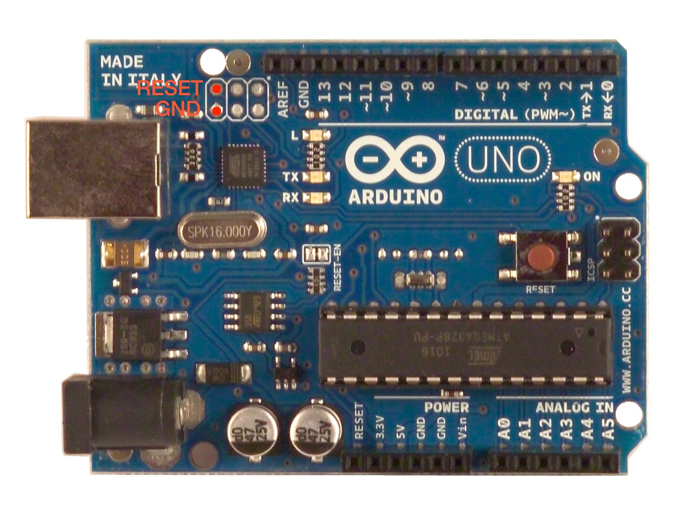
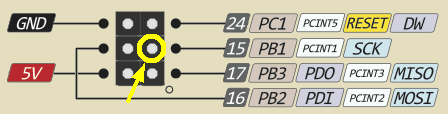

# Libraries for Pose-Trigger output

## Overview

For output boards, the following options are provided by default:

- [**Arduino-fasteventoutput**](#arduino-fasteventoutput) (recommended): requires a few extra steps to work on, but the output is faster.
- [**SimpleArduinoOutput**](#simplearduinooutput): only the [Arduino IDE](https://www.arduino.cc/en/Main/Software) is required, without any complex installation procedures. On the other hand, there may be a little bit of overhead (1–2 ms) in the output latency.

To let Pose-Trigger make use of the output board, install [**FastEventServer**](#fasteventserver).

## Arduino-fasteventoutput

This is a program to be uploaded to your Arduino UNO so that it can be used as a fast-output board. Prerequisites and installation procedures are as follows.

### Installation

#### Prerequisite: Arduino UNO

`fasteventoutput` requires an Arduino UNO single-board computer (rev. 2 or later), or one of its "clones".

**NOTE**: in reality, it only engages the usb-to-serial converter chip (ATmega16U2) on the UNO, i.e. it does _not_ use the ATmega328P (the main microcontroller of UNO). Make sure that your clone uses ATmega16U2 as the usb-to-serial converter.

#### Prerequisite: dfu-programmer

Programming the AVR microcontroller (those utilized by Arduino's) over the USB cable uses the special, **"Device Firmware Update" (DFU) mode** of the chip. Although the AVR program itself is provided here, you need to install another application that takes care of writing to a device in the DFU mode.

There is a free software called [dfu-programmer](http://dfu-programmer.github.io/) that exactly does this job. Install it to any of your Linux computers. The package manager on your computer can take care of all the necessary installation procedures:

- (On linux) run e.g. `sudo apt-get dfu-programmer` (depending on your distribution, the command `apt-get` can be `aptitude`, `pacman` etc.).

UNO boards (rev. 2 and later) can be put into the DFU mode by briefly connecting the `RESET` and `GND` pins of the 6-pin header connected to the ATmega16U2 chip. The image below shows the positions of the `RESET` and `GND` pins (and their 6-pin header):



#### Writing `fasteventoutput` to the Arduino board

All the procedures are described in details in the [official Arduino website](https://www.arduino.cc/en/Hacking/DFUProgramming8U2), but the essence is stated in brief here, too:

1. Plug in your UNO board to your Linux PC (where `dfu-programmer` is installed).
2. Open this `libary` directory in Terminal.
3. Check that the UNO is recognized by the PC:
   - Plug in and out the UNO board, and run `ls -l /dev | grep ttyACM` every time.
   - There should be a name (e.g. `ttyACM0`) that shows up only when the UNO is connected to the PC. This name corresponds to the name of the UNO.
4. Turn the UNO into the DFU mode, by connecting the `RESET` and `GND` pins briefly using a piece of wire (see the image above).
   - Do _not_ disconnect the UNO and the PC hereafter.
   - Make sure that the device disappears from the list shown by  `ls -l /dev | grep ttyACM` , even when the UNO board is plugged in.
5. Erase the existing program by running `sudo dfu-programmer atmega16u2 erase`
6. Write `fasteventoutput` to the UNO by running `sudo dfu-programmer atmega16u2 flash Arduino-fasteventoutput.hex`
7. Reset (re-boot) the UNO by running `sudo dfu-programmer atmega16u2 reset`
8. Check that the UNO board is recognized by the PC again.
   - use  `ls -l /dev | grep ttyACM`  again.
   - The device will show up only after un-plugging the board and plugging it in again.

**NOTE**: by writing `fasteventoutput` to the Arduino board, it cannot be used any more as an Arduino. In case you want to "resume" the Arduino functionalities, write back the [official Arduino firmware](https://github.com/arduino/ArduinoCore-avr/tree/master/firmwares/atmegaxxu2) using `dfu-programmer` again by following the same procedures. 

#### (Optional) Building the code yourself

In case you want to build the `fasteventoutput.hex` file yourself, consult the README file in `source/arduino-fasteventtrigger` directory.

### Testing the board

#### Output pin

To visualize the output, connect the `PB1` pin of the 6-pin ATmega16U2 header (refer to the image below) to the cathode of an LED, or to an oscilloscope (use the `GND` pin as the 0 V reference):



(the above image is adapted from the diagram by https://www.bq.com, licensed under the CC-BY-SA 4.0)

#### Serial monitor

Instead of using through FastEventServer, you can communicate with the output board directly via serial communication. Any serial monitor tool, e.g. [the "Serial Monitor" of Arduino IDE](https://arduinogetstarted.com/tutorials/arduino-serial-monitor), may be used.

- **Serial port**: the port name you identified in the previous section (e.g. `/dev/ttyACM0`)
- **Baud rate**: 230400 baud (the rate does not matter anyway, but set this way just in case)
- **Newline**: "No line ending" (the board ignores the newline characters anyway)

#### Serial commands

The following single-character commands are available:

| Name    | Character | Description            |
| ------- | --------- | ---------------------- |
| `CLEAR` | `H`       | Set the output to LOW  |
| `EVENT` | `L`       | Set the output to HIGH |

(*)Note that the command characters themselves do not really mean HIGH/LOW. On the side of the UNO board, in reality, it applies the bit flag `0x04` to the command to determine the output of the `PB5` pin.

## SimpleArduinoOutput

The directory `SimpleArduinoOutput` is a sketch for the [Arduino IDE](https://www.arduino.cc/en/Main/Software) in case you want to use Arduino as the output board, but do not want to follow any complex installation steps. In principle, you can **just upload the sketch to your Arduino (just like any other sketches), and you are done**.

The only drawback is that you may experience **a little bit of latency overhead (1–2 ms)** when communicating with the board.

### Testing the sketch

#### Output pin

The output pin is set to GPIO#13 (which, normally, is connected to the on-board LED of the Arduino).

#### Serial monitor

Instead of using through FastEventServer, you can communicate with the Arduino directly via serial communication. Any serial monitor tool, e.g. [the "Serial Monitor" of Arduino IDE](https://arduinogetstarted.com/tutorials/arduino-serial-monitor), may be used.

- **Serial port**: Your Arduino board
- **Baud rate**: 230400 baud
- **Newline**: "No line ending" (the board ignores the newline characters anyway)

#### Serial commands

The following single-character commands are available:

| Name    | Character | Description            |
| ------- | --------- | ---------------------- |
| `CLEAR` | `H`       | Set the output to LOW  |
| `EVENT` | `L`       | Set the output to HIGH |

(*)Note that the command characters themselves do not really mean HIGH/LOW. On the side of the UNO board, in reality, it applies the bit flag `0x04` to the command to determine the output of GPIO#13.


## FastEventServer

By using FastEventServer, you can:

- receive trigger commands from any client program via UDP communication.
- generate trigger output using the Arduino-based output board.

### Installation

#### For Intel 64bit CPU-based PCs (e.g Core i7, Cerelon)

You can use the pre-built `FastEventServer_linux_x86-64` program binary file. For example, you can install it in the following way:

1. Open this `libraries` directory in Terminal.
2. Add executable flag (just in case it does not) by running: `chmod 755 FastEventServer_linux_x86-64`
3. Copy the program to the local executables directory by running: `sudo cp FastEventServer_linux_x86-64 /usr/local/bin/FastEventServer`

You can check the installation by running `which FastEventServer` (in case of bash/zsh) in your Terminal. If the output is `/usr/local/bin/FastEventServer`, then your installation must have been successful.

#### For PCs with other CPUs: building from the source

You need to build the program binary from the source.

1. Open `source/FastEventServer` directory on Terminal.
2. Load the `libks` submodule by running `git submodule init libks`.
3. Build by running `make` (type "make" in the Terminal and press enter). This will update the `FastEventServer_linux_**bit` program binary in the directory.
4. Copy the built program file into e.g. `/usr/local/bin/` as in the previous section.

### Configuration

The way FastEventServer runs is managed by a JSON file, `service.cfg` (available in this `libraries` directory).

| Entry          | Description                                                  |
| -------------- | ------------------------------------------------------------ |
| `port`         | The UDP port that FastEventServer listens to the incoming client connections |
| `driver`       | The type of the output driver. For the time being, `leonardo`, `uno`, and `dummy` (no output, but prints out the current state) drivers are available. |
| `options/port` | Which serial port to use in case of Arduino-based output boards. |

Edit the `driver` entry value in `service.cfg`, and put the file wherever convenient for you, according to your needs:

| Board type                                              | `driver` entry |
| ------------------------------------------------------- | -------------- |
| `Arduino-fasteventoutput` board                         | `"leonardo"`   |
| `SimpleArduinoOutput`, with Arduino micro/Leonardo etc. | `"leonardo"`   |
| `SimpleArduinoOutput`, with Arduino UNO/Mini/Nano etc.  | `"uno"`        |

In addition, put the path to your output board (e.g. `/dev/ttyACM0`) in the `options/port` entry.

Leave the `port` entry to be `11666`, as Pose-Trigger assumes this port for FastEventServer.

### Running FastEventServer

1. Open Terminal window in the directory containing `service.cfg` (it must be a separate session from the one running Pose-Trigger).
2. Run the following command: `FastEventServer service.cfg`

Shut down the server by sending the shut-down command from a client, or press `Ctrl-C` in the Terminal session running FastEventServer.

### Testing the service

#### Python client

After installation of Pose-Trigger, you can test the service by using a `posetrigger.trigger.Client` instance:

```python
>>> from posetrigger.trigger import Client
>>> conn = Client() # optionally you can set `host=<address to the server PC>`
>>> conn.event = True # pull the output to HIGH
>>> conn.event = False # pull the output to LOW
>>> conn.shutdown() # closes the connection AND shuts down the server
    # if you do not want to shut down the server, use `conn.close()` instead
```

#### The FastEventServer protocol

The FastEventServer protocol uses a 8-bit index to identify the response to the corresponding request, in addition to the 8-bit command byte.

- **Client side**: the client sends a two-byte packet to the server.
  - The first byte contains the **request index** in the form of 8-bit unsigned integer.
  - The second byte represents the **command byte**, which simply contains the requested state of the output as binary flags. Turning on the output uses the flag `0x10`. The "shut-down" command is `0x03` (you don't need to send anything if you just close the connection).
- **Server side**: the server acknowledges the request by returning a two-byte state packet to the client.
  - The first byte contains the same request index that the client used, to specify which request the server acknowledges.
  - The second byte contains the current state of the output, in terms of binary flags. Thus, if the bit `0x10` is flagged, the output is on.

**IMPORTANT NOTE**: the default Python client in Pose-Trigger assumes that all the requests must be immedeately acknowledged by the server. Failure in communication with the server (e.g. if a request/response packet is lost in the network traffic) immediately results in a halt of the Pose-Trigger program.

